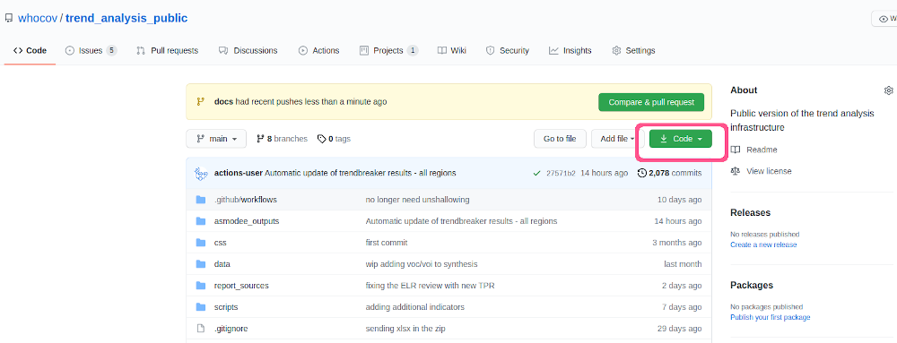

# Getting started {#getting-started}

In this chapter, we provide an overview of the folders and files making up this
infrastructure, and guidelines for using it locally.


## Overview of the infrastructure

The data infrastructure is a
[*reportfactory*](https://www.reconverse.org/reportfactory/), which provides a
structure for storing data, auxiliary scripts, reports sources and their
outputs. The main components are:

* **data/**: a folder where raw and clean data are stored; the content of this
  folder is not stored on github to minimize the size of the git archive

* **report_sources/**: a folder containing the sources of the `Rmd` reports doing
  the data gathering and cleaning, and all analyses; see the [reports](#reports)
  chapter for more information

* **scripts/**: a folder containing `R` scripts used in the various reports; this
  includes small helper functions to load the latest versions of the data, help
  with bits of analysis, and code for installing packages not on CRAN, which
  cannot be handled automatically by `reportfactory::install_deps()`

* **outputs/**: a folder containing all compiled reports and associated outputs,
  in timestamped folders; this content is automatically generated when using
  `reportfactory::compile_reports()`, and is only stored locally (i.e. on your
  machine), and not on github (to keep the git archive to a minimal size)
  
* **css/**: a folder containing styling for the reports

* **asmodee_outputs/**: a folder containing outputs of the main analysis, shared on
  github; this includes images (pinplots and tadpoles), **R** objects (`rds`
  files) containing re-usable analysis results (e.g. for inclusion in websites
  or dashboards), and analysis notes (indicating excluded countries, and reasons
  for their exclusions)
  
* **docs/**: a folder containing the sources and compiled versions of this
  handbook

Other useful files and folders to know of include:

* **README.Rmd**: the source of the `README.md` file, which is displayed on the
  landing package of the [github project](https://github.com/whocov/trend_analysis_public), 
  and shows the latest tadpoles figures by WHO region and also provides links to
  the corresponding `rds` files

* **run_factory.R**: the main R script used in github actions to automate the
  generation of analysis reports for every WHO regions
  
* **run_synthesis.R**: an R script used in github actions to generate a synthesis
  report for all countries, including a classification into levels of risk based
  on incidence, growth and trend acceleration, and sending an email to list of
  recipients with these documents attached
  
* **.github/workflows/**: a (hidden) folder storing the files used to define the
  github actions; see the [automation](#automation) chapter for more information
  
* **factory_config**: a simple text file containing some information about the
  name of key directories of the factory; normally will not need editing, unless
  you rename the folder containing the factory (see below)


## Installing the infrastructure

The infrastructure can be installed locally by downloading the repository from
github and installing dependencies. To run the full pipeline, the user will need
an authentication token used to install the private (i.e. not publicly
available) WHO package `phifunc`, which is used for collating data.

### Downloading the repository

You can download the repository from the **code** tab on the github page
https://github.com/whocov/trend_analysis_public
as illustrated in the figure below:

```{r fig.align='center', echo=FALSE}

```

We recommend using *SSH* to clone the repository; using GIT from the command
line in your favourite terminal, you will need to type:

```{eval = FALSE}
git clone git@github.com:whocov/trend_analysis_public.git
```

The advantage of cloning the repository rather than merely downloading a zip
archive is that you will be able to update the infrastructure automatically
using `git pull`.


By default, your local copy of the repository will be called
*trend_analysis_public*. It is possible to change this name, but you will need
to update the name of the factory in the **factory_config** file. From now on,
we will refer to this folder as **root folder**.


### Getting the phifunc authentication token

The tool we use to collate COVID-19 data is a package called `phifunc` developed
at WHO. Because this package internally uses some non-public data API, it is
currently not shared publicly, and an **authentication token** is needed to be
able to install it in **R**. This token is a kind of *password*, stored in a
file called `phifunc_token` in the root folder.

The easiest way to add this file is ask for it from someone in the COVID-19
analytics team, and add this file to the root of the project. Make sure you do
not alter or rename it. Once `phifunc_token` is present in your infrastructure,
the scripts installing dependencies will detect it automatically when run, and
you will be able to run all analyses locally.


### Installing dependencies

To install the dependencies, open the reportfactory by double-clicking on
`open.Rproj`, or otherwise starting an R session in the **root** folder
(*trend_analysis_public* by default), and copy-paste the following commands:

```{r eval = FALSE}

# install basic packages
pkg <- c("remotes", "reportfactory")
install.packages(pkg)

# install deps for the factory
reportfactory::install_deps()
source(here::here("scripts", "remote_packages.R"))

```

Note that the last operation will require the authentication token (file
`phifunc_token`) for installing *phifunc*, which is used for data collection and
formatting.


## Running the infrastructure locally

